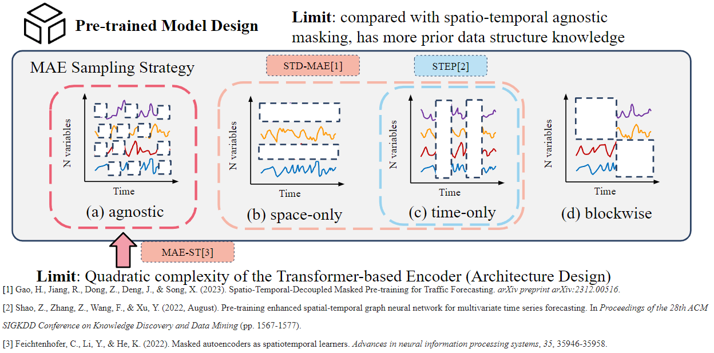
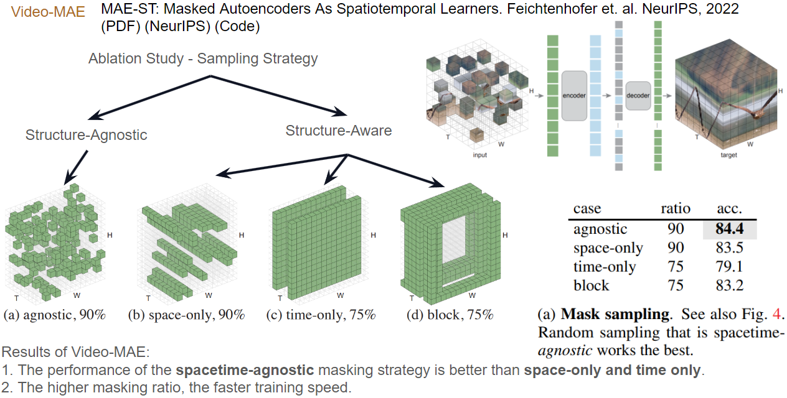
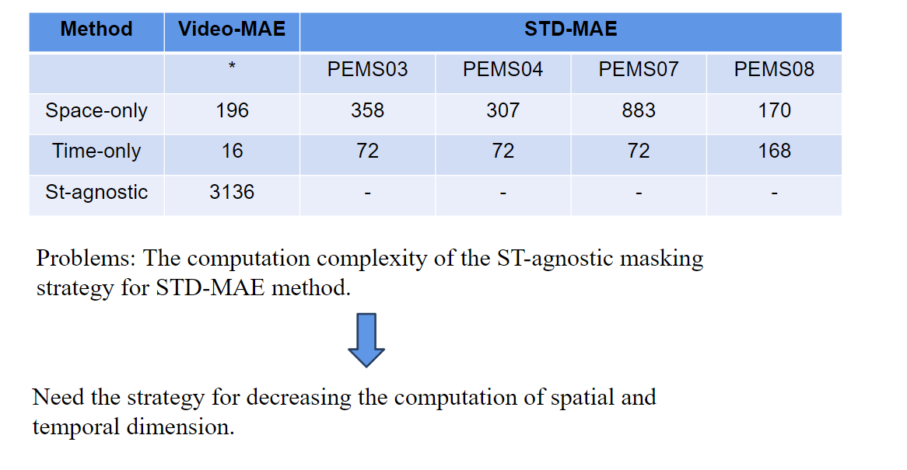
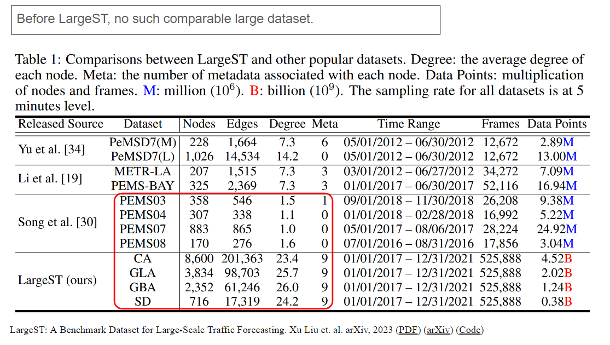
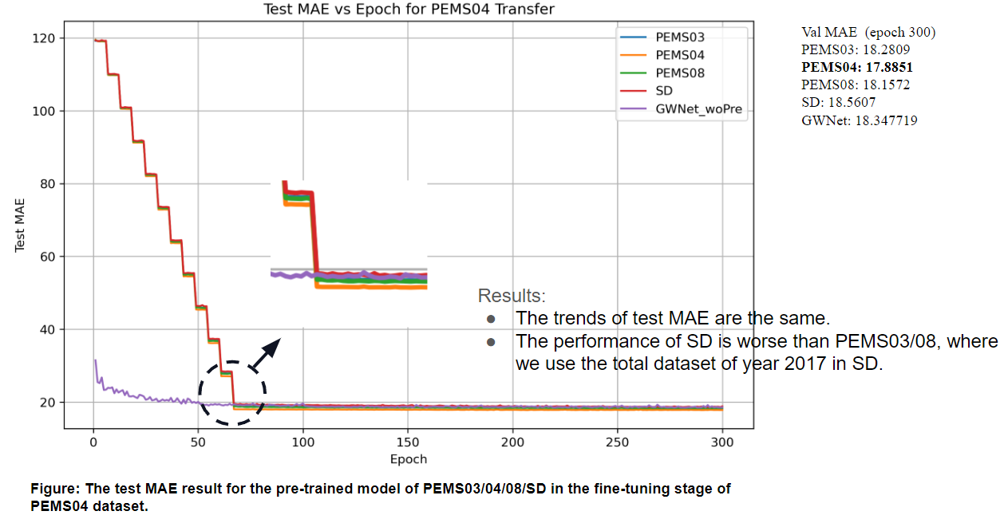
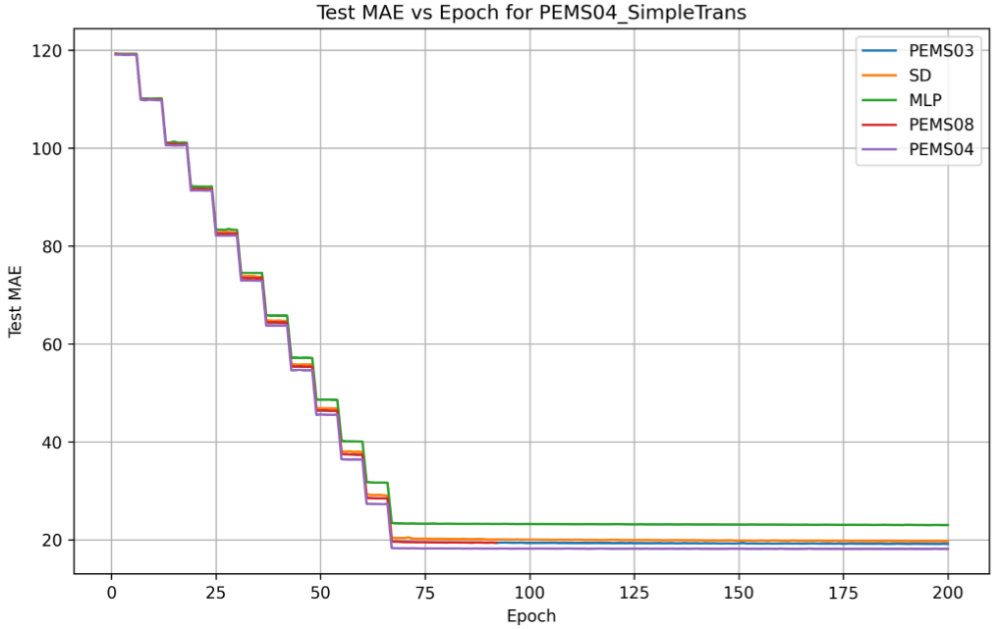
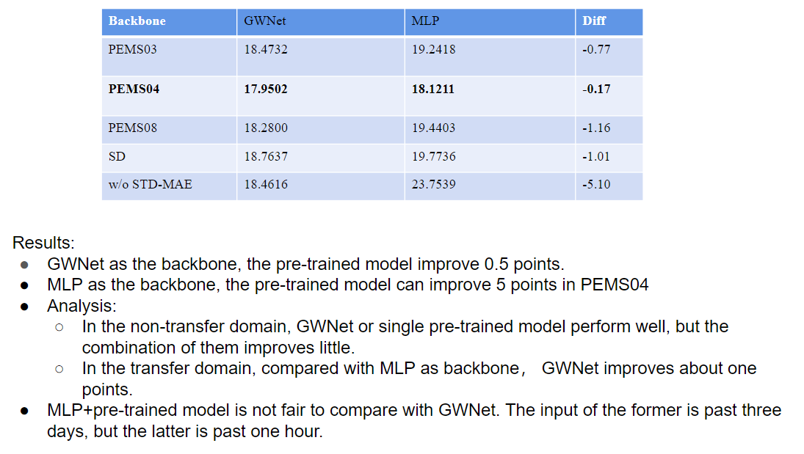

# Spatio-Temporal-Agnostic Masked Pre-training

## Dependencies

The code is implemented based on [STD-MAE](https://github.com/jimmy-7664/std_mae), which is realized on [BasicTS](https://github.com/zezhishao/BasicTS/tree/master) and [STEP](https://github.com/zezhishao/STEP/tree/github ).

## Thinking 1: ST-Agnostic Masking
+ 掩码预训练方式在STEP和STD-MAE的效果好于之前的SOTA方*法，俩者分别采用是时间掩码和时空解耦掩码。
+ 而Kaiming的Video-MAE工作展现出来ST-Agnostic随机掩码的性能提升。
+ Traffic和Video本质都是时空数据，这一部分尝试验证ST-Agnostic掩码的效果。

## Thinking 2: LargeST Transfer
+ 相比于PEMS0x数据集，LargeST中提出了在时空维度都很大的数据集，包含了加州5年的Traffic Datasets
+ 该部分要想要验证下大数据集相比于PEMS0x在城市迁移上的提升效果。

